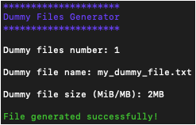

# Dummy Files Generator
Dummy Files Generator is a simple utility designed to generate dummy files of arbitrary size.

## Quickstart Guide
To generate one or more dummy files:

- Insert the number of dummy files to generate.
- Insert dummy file name including the extension.
- Insert dummy file size, either in MiB or MB.

An example is shown in the picture below:

